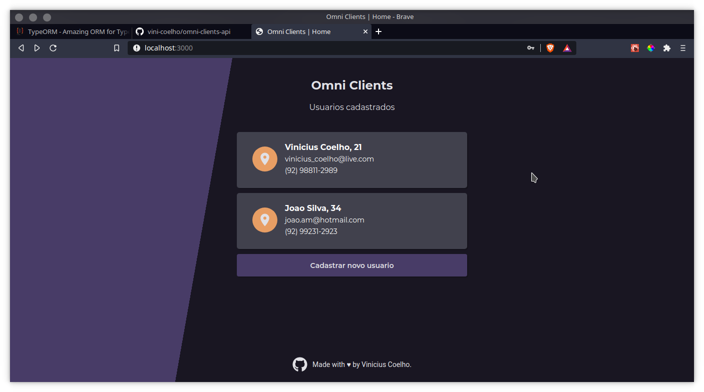
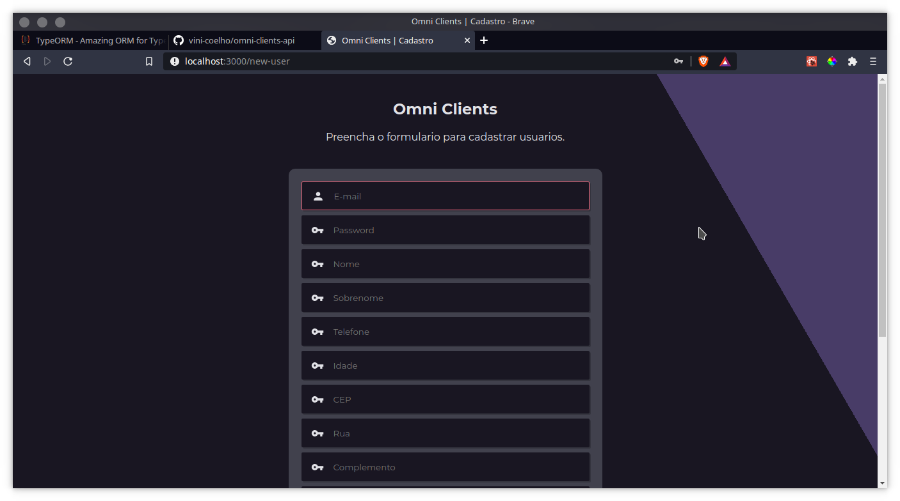

<h1 align="center">
    <br>
    :bookmark_tabs: Omni Clients
</h1>

<h4 align="center">
  Interface de cadastro de usuários construído com NextJS & Styled Components :nail_care:
</h4>

## :camera: Screenshots

<div align="center">
    
</div>
<div align="center">
    
</div>

## :rocket: Tecnologias utilizadas

Este projeto foi desenvolvido por **Vinícius Coelho** como parte da resposta ao desafio proposto no processo de seleção para a vaga de *Software Engineer* da **Bemol Digital**, utilizando as seguintes tecnologias:

-  [ReactJS][react]
-  [NextJS][nextjs]
-  [Axios][axios]
-  [TypeScript][ts]
-  [Styled Components][sc]
-  [Formik][formik]
-  [Yup][yup]
-  [Visual Studio Code][vc] com [EditorConfig][vceditconfig]

## :information_source: Como utilizar

Esta aplicação consome a API REST `omni-clients-api`, portando é essencial tê-la rodando em sua máquina antes de tudo. Para isso, siga as instruções [deste link](https://github.com/vini-coelho/omni-clients-api), e depois prossiga com os passos abaixo.

Para clonar e rodar esta aplicação, você vai precisar de [Git](https://git-scm.com), [Node.js v14.15.4+][nodejs] e [Yarn v1.22+][yarn] instalados na sua máquina.

No seu Terminal ou Console, siga os passos:

```bash
# Clone este repositório
$ git clone https://github.com/vini-coelho/omni-clients

# Entre no repositório
$ cd omni-clients

# Instale as dependências
$ yarn install

# inicie o servidor de desenvolvimento
$ yarn dev
```


A aplicação ficará disponível no endereço http://localhost:3000

---

Made with ♥ by Vinicius Coelho :wave: [Get in touch!](https://www.linkedin.com/in/viniciustcoelho/)

[nodejs]: https://nodejs.org/
[yarn]: https://yarnpkg.com/
[npm]: https://www.npmjs.com/
[vc]: https://code.visualstudio.com/
[vceditconfig]: https://marketplace.visualstudio.com/items?itemName=EditorConfig.EditorConfig
[vceslint]: https://marketplace.visualstudio.com/items?itemName=dbaeumer.vscode-**eslint**
[express]: https://expressjs.com/
[typeorm]: https://typeorm.io/
[ts]: https://www.typescriptlang.org/
[sqlite]: https://www.sqlite.org/
[cors]: https://www.npmjs.com/package/cors
[react]: https://pt-br.reactjs.org/
[nextjs]: https://nextjs.org/
[sc]: https://styled-components.com/
[axios]: https://github.com/axios/axios
[formik]: https://formik.org/
[yup]: https://github.com/jquense/yup

